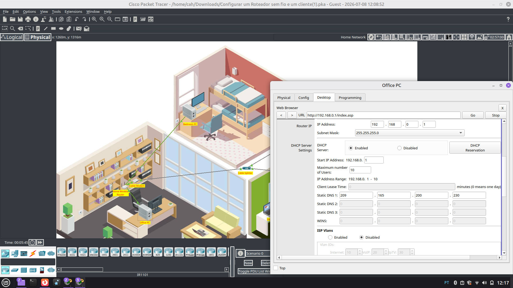
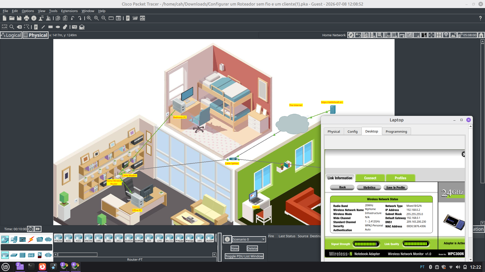

# 🛜 Configurar um roteador sem fio e clientes

## Objetivo

Configurar uma rede doméstica utilizando um roteador sem fio, conectando dispositivos com e sem fio, configurando o DHCP, a rede Wi-Fi e a segurança WPA2, e verificando a conectividade com a Internet.

## Cenário

Nesta atividade, foi simulada a configuração da rede doméstica de uma residência, incluindo:

- Conexão de um Cable Modem ao Home Wireless Router
- Conexão de computadores por cabo Ethernet
- Configuração do roteador sem fio
- Configuração do servidor DHCP
- Configuração da rede Wi-Fi
- Configuração da segurança WPA2 Personal
- Conexão de um laptop à rede sem fio
- Testes de conectividade com a Internet

## Habilidades praticadas

- Conexão de dispositivos de rede
- Configuração de um roteador sem fio
- Configuração de DHCP
- Configuração de uma rede LAN
- Configuração de uma rede WLAN
- Configuração de SSID
- Configuração de segurança WPA2
- Conexão de dispositivos a uma rede Wi-Fi
- Configuração automática de endereçamento IP
- Verificação de conectividade de rede
- Utilização do Cisco Packet Tracer

## Evidências

### Configuração do DHCP

Configuração do servidor DHCP no Home Wireless Router, limitando o número máximo de usuários da rede.

### Conexão do Laptop

Informações da conexão do laptop após sua conexão à rede sem fio.

## Conceitos estudados

- DHCP (Dynamic Host Configuration Protocol)
- Endereço IPv4
- Gateway padrão
- LAN (Local Area Network)
- WLAN (Wireless Local Area Network)
- SSID (Service Set Identifier)
- WPA2 Personal
- Endereçamento IP
- Roteador sem fio
- Cable Modem
- Conectividade de rede

## Resultado

A rede doméstica foi configurada com sucesso no Cisco Packet Tracer. Os dispositivos receberam endereços IP por DHCP, o laptop foi conectado à rede sem fio utilizando WPA2 e os dispositivos foram capazes de acessar um servidor externo, confirmando a conectividade com a Internet.
