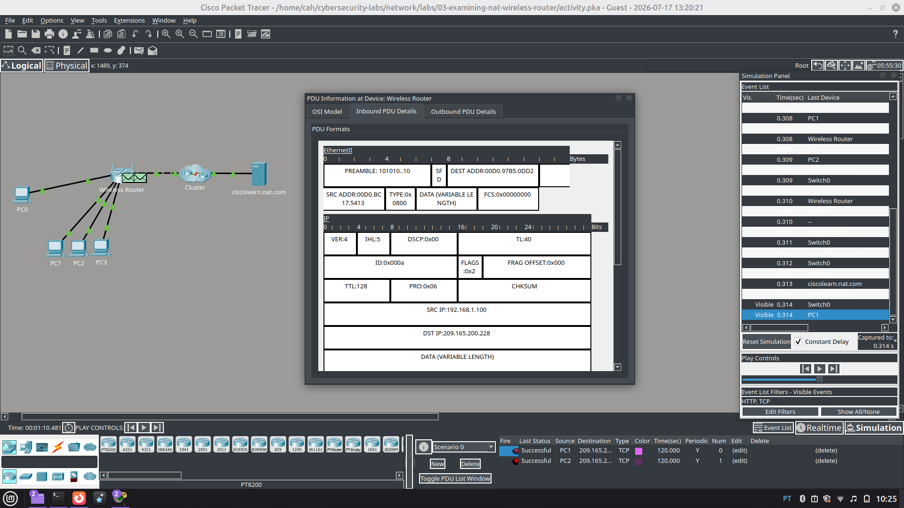
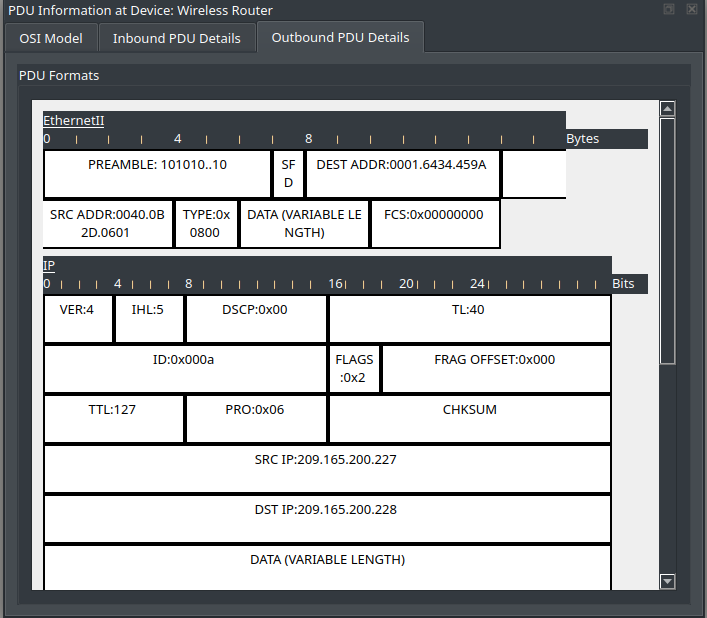

# 🛜 Examinando o NAT em um Roteador Wireless

## Objetivo

Examinar o funcionamento do **NAT (Network Address Translation)** em um roteador wireless e observar como endereços IP privados são traduzidos durante a comunicação com uma rede externa.

A atividade também envolve a configuração de hosts utilizando DHCP e a análise do tráfego de rede no modo de simulação do Cisco Packet Tracer.

---

## Cenário

A atividade simula uma rede doméstica conectada à Internet por meio de um roteador wireless.

Os computadores da rede local recebem endereços IP privados através do DHCP. Durante a comunicação com um servidor externo, o roteador realiza a tradução do endereço IP de origem utilizando NAT.

A análise dos pacotes permite observar a alteração do endereço de origem ao atravessar o roteador.

---

## Habilidades praticadas

- Configuração de hosts utilizando DHCP
- Identificação de endereços IP públicos e privados
- Identificação do gateway padrão
- Análise da configuração NAT em um roteador wireless
- Observação do tráfego de rede no modo Simulation
- Criação e análise de PDU
- Análise de cabeçalhos de pacotes
- Identificação da alteração do endereço IP durante a tradução NAT
- Uso do Cisco Packet Tracer para análise de conectividade

---

## Evidências

### Tradução do endereço IP

A análise dos detalhes da PDU permite observar a alteração do endereço IP de origem durante a passagem do pacote pelo roteador.

---

## Conceitos estudados

- NAT (Network Address Translation)
- Endereços IP públicos e privados
- DHCP
- Gateway padrão
- Roteador wireless
- Comunicação entre rede local e rede externa
- Cabeçalhos de pacotes
- Endereço IP de origem e destino
- TCP e HTTP
- Simulação de tráfego de rede

---

## Resultado

A atividade permitiu observar, de forma prática, como o NAT atua na comunicação entre uma rede local que utiliza endereços IP privados e uma rede externa.

A análise dos cabeçalhos das PDUs possibilitou identificar a alteração do endereço IP de origem durante o processo de tradução realizado pelo roteador.
