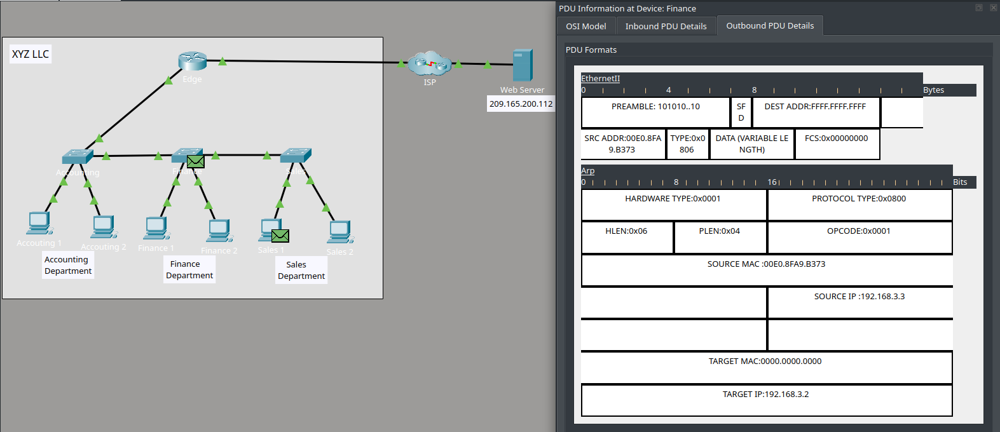
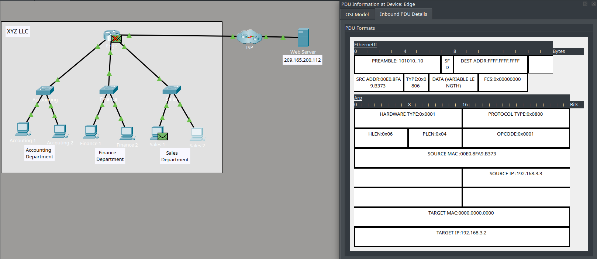

# 🛜 Observando o Tráfego em uma Rede Roteada

## Objetivo

Observar o comportamento do tráfego em uma rede antes e depois da implementação de roteamento entre diferentes redes IPv4.

A atividade utiliza o modo de simulação do Cisco Packet Tracer para analisar o fluxo de PDUs, o funcionamento do ARP e o impacto da segmentação da rede na propagação de broadcasts.

## Cenário

A atividade apresenta uma rede corporativa inicialmente configurada como uma única rede IPv4, com diferentes departamentos conectados aos mesmos segmentos de rede.

Na primeira etapa, foi analisado o comportamento do tráfego e das solicitações ARP em uma LAN não roteada.

Em seguida, a rede foi reconfigurada para separar os departamentos em diferentes redes IPv4, utilizando um roteador para realizar a comunicação entre as LANs.

## Atividades realizadas

- Análise do cache ARP de um host.
- Observação de solicitações ARP em uma LAN não roteada.
- Análise de endereços MAC e IP nas PDUs.
- Observação do impacto de broadcasts ARP em uma rede compartilhada.
- Reconfiguração da topologia para utilizar roteamento entre LANs.
- Renovação de endereços IP utilizando DHCP.
- Identificação das redes IPv4 atribuídas aos diferentes departamentos.
- Análise do fluxo de tráfego após a segmentação da rede.
- Comparação da propagação de broadcasts antes e depois do roteamento.
- Utilização do Simulation Mode e da ferramenta Capture then Forward do Cisco Packet Tracer.

## Conceitos praticados

- IPv4
- Sub-redes
- Roteamento
- ARP
- Endereços MAC
- Broadcast
- DHCP
- Comunicação entre redes
- Segmentação de redes
- Análise de tráfego
- Cisco Packet Tracer

## Evidências

#### 1. Broadcast ARP em uma LAN não roteada

Antes da implementação do roteamento entre as LANs, a solicitação ARP é propagada pela rede local, fazendo com que outros dispositivos do mesmo segmento recebam o broadcast.

#### 2. Broadcast ARP após a segmentação da rede

Após a separação dos departamentos em diferentes redes IPv4, a solicitação ARP permanece restrita à rede de origem. Ao chegar ao roteador Edge, o broadcast não é encaminhado para as demais interfaces, reduzindo o domínio de broadcast e o tráfego desnecessário nas outras redes.

## Resultado

A atividade permitiu observar, de forma prática, a diferença no comportamento do tráfego entre uma rede única e uma rede segmentada em diferentes sub-redes.

Foi possível verificar que, após a implementação do roteamento entre LANs, os broadcasts ARP ficam restritos ao segmento de rede correspondente, reduzindo a quantidade de dispositivos que precisam processar essas mensagens.

Essa análise ajudou a consolidar conceitos de **ARP, IPv4, DHCP, sub-redes e roteamento**, além de reforçar a importância da segmentação na organização e eficiência de redes maiores.
