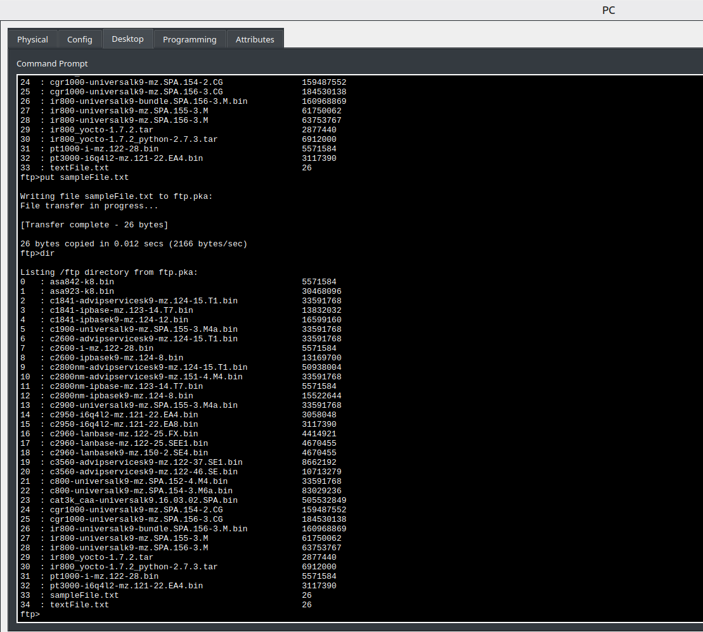

# 🛜 FTP Services

## Objetivo

Praticar o uso do **File Transfer Protocol (FTP)** em uma rede simulada, realizando operações de upload e download de arquivos entre um cliente e um servidor FTP.

## Cenário

Atividade prática realizada no Cisco Packet Tracer para compreender o funcionamento básico de uma comunicação entre **cliente e servidor utilizando FTP**.

Durante o laboratório, foi utilizado um PC para estabelecer uma conexão com um servidor FTP, realizar autenticação e executar operações de gerenciamento e transferência de arquivos.

## Atividades realizadas

- Conexão com um servidor FTP por endereço IP e hostname.
- Autenticação utilizando usuário e senha.
- Navegação e consulta de arquivos disponíveis no servidor.
- Upload de arquivo utilizando `put`.
- Download de arquivo utilizando `get`.
- Renomeação de arquivos com `rename`.
- Exclusão de arquivos com `delete`.
- Consulta de diretórios utilizando `dir`.
- Utilização do cliente FTP por linha de comando.

## Comandos praticados

| Comando | Função |
|---|---|
| `ftp` | Estabelece conexão com um servidor FTP |
| `dir` | Lista os arquivos disponíveis |
| `put` | Envia um arquivo para o servidor |
| `get` | Baixa um arquivo do servidor |
| `rename` | Renomeia um arquivo |
| `delete` | Remove um arquivo |
| `quit` | Encerra a sessão FTP |
| `?` | Exibe os comandos disponíveis |

## Conceitos estudados

- Modelo cliente-servidor
- FTP (File Transfer Protocol)
- Autenticação em serviços de rede
- Transferência de arquivos
- Comunicação por portas
- Utilização de terminal para interação com serviços de rede

## Evidência

Registro da sessão FTP demonstrando a transferência de arquivos entre o cliente e o servidor.

## Resultado

A atividade permitiu praticar a comunicação entre um cliente e um servidor FTP, incluindo autenticação, consulta de arquivos, upload, download, renomeação e exclusão de arquivos utilizando comandos de terminal.
