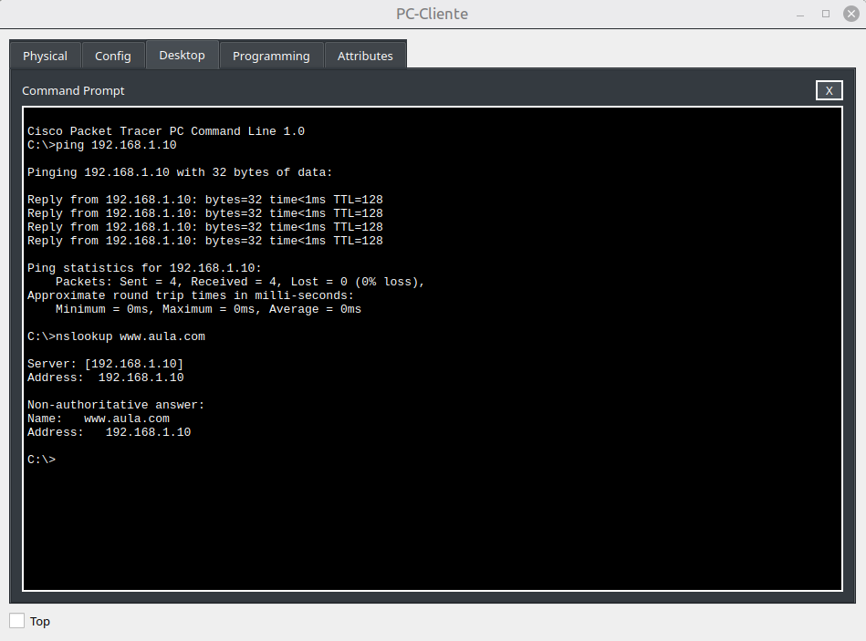
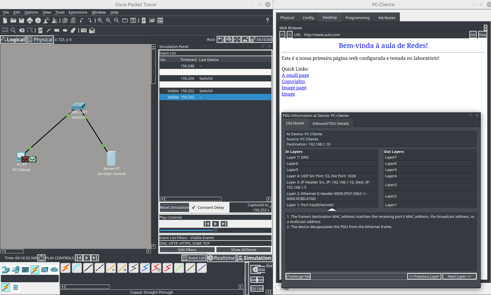

# 🛜 Network Services: DNS, HTTP, TCP and ICMP

## Objetivo

Construir e testar uma pequena rede cliente-servidor utilizando serviços de **DNS e HTTP**, além de analisar a comunicação através de **ICMP e TCP** no Cisco Packet Tracer.

## Cenário

Neste laboratório, foi configurada uma rede local contendo um PC cliente e um servidor conectados por um switch.

O servidor foi configurado para disponibilizar um serviço web e realizar a resolução de nomes DNS. O cliente foi utilizado para testar a conectividade, consultar o DNS e acessar a página web.

## Configurações realizadas

* Configuração de endereçamento IPv4.
* Configuração de servidor HTTP/HTTPS.
* Configuração de serviço DNS.
* Criação de um registro DNS para o servidor web.
* Teste de conectividade utilizando `ping`.
* Consulta de resolução de nomes utilizando `nslookup`.
* Acesso ao servidor através de um navegador web.
* Análise do tráfego no Simulation Mode do Packet Tracer.
* Observação das PDUs relacionadas aos protocolos DNS, TCP, HTTP e ICMP.

## Comandos praticados

| Comando    | Finalidade                                 |
| ---------- | ------------------------------------------ |
| `ping`     | Verificar conectividade entre dispositivos |
| `nslookup` | Consultar a resolução de nomes DNS         |

## Conceitos estudados

* Modelo cliente-servidor
* DNS
* HTTP e HTTPS
* TCP
* ICMP
* Endereçamento IPv4
* Resolução de nomes
* Portas e protocolos
* Comunicação entre dispositivos
* Análise de PDUs no Cisco Packet Tracer
* Relação entre as camadas do modelo TCP/IP e OSI

## Evidências

### Testes de conectividade e DNS

### Análise de tráfego no Simulation Mode

## Resultado

A rede foi configurada e validada com sucesso. O cliente conseguiu estabelecer comunicação com o servidor, resolver o endereço através do DNS e acessar o serviço web.

A análise no Simulation Mode permitiu observar o fluxo das PDUs e relacionar os protocolos DNS, TCP, HTTP e ICMP ao processo de comunicação entre cliente e servidor.
