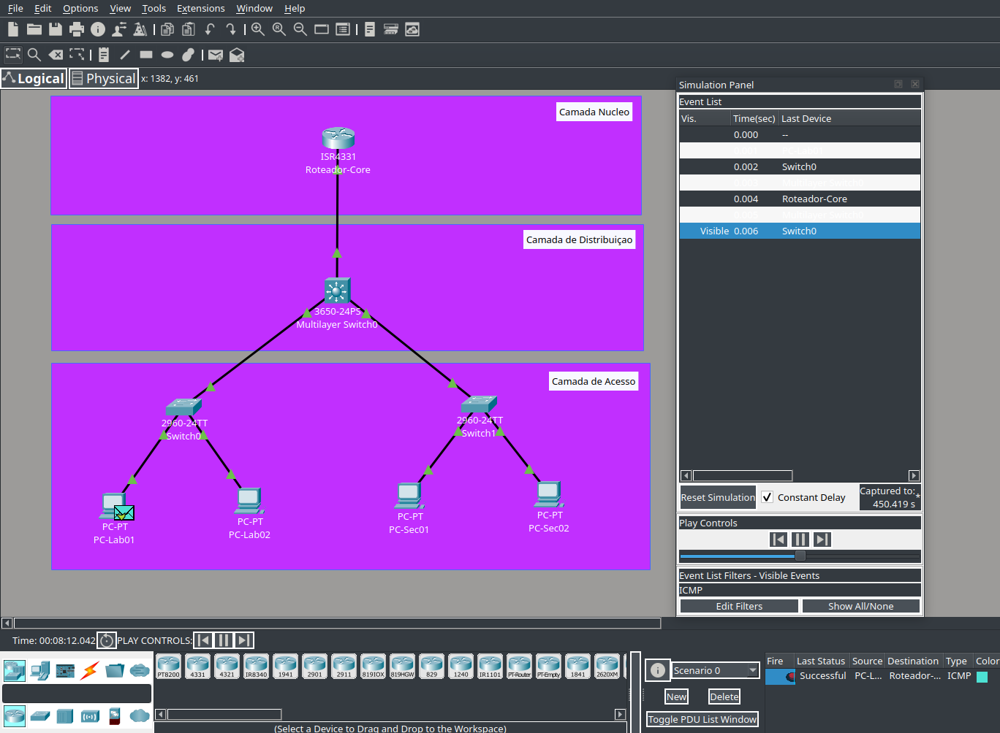

# 🛜 Introdução às Redes Hierárquicas

## Descrição

Neste laboratório, eu construí uma rede corporativa no Cisco Packet Tracer utilizando o modelo hierárquico de três camadas: **Acesso, Distribuição e Núcleo (Core)**.

Configurei o endereçamento IPv4 dos dispositivos, ativei a interface do roteador e testei a conectividade da rede utilizando ICMP.

## Objetivo

Compreender como o modelo hierárquico organiza uma rede corporativa e observar o caminho do tráfego entre os dispositivos.

## Contexto

A topologia representa uma pequena rede corporativa composta por:

- 1 roteador Cisco 4331 — Camada Core
- 1 switch Cisco 3650 — Camada de Distribuição
- 2 switches Cisco 2960 — Camada de Acesso
- 4 PCs — Dispositivos finais

## Procedimento

1. Montei a topologia seguindo a estrutura **Acesso → Distribuição → Core**.
2. Conectei os dispositivos utilizando cabos Copper Straight-Through.
3. Configurei o endereçamento IPv4 dos quatro PCs.
4. Configurei e ativei a interface `GigabitEthernet0/0/0` do roteador.
5. Testei a conectividade entre os dispositivos utilizando `ping`.
6. Utilizei o modo **Simulation** do Packet Tracer para observar o fluxo de uma PDU ICMP pela topologia.

## Resultado e aprendizados

A configuração permitiu estabelecer comunicação entre os dispositivos e validar a conectividade com o roteador.

Com esta atividade, pratiquei:

- Organização de redes no modelo hierárquico;
- Endereçamento IPv4;
- Configuração básica de interfaces Cisco;
- Uso da CLI do Cisco IOS;
- Testes de conectividade com ICMP;
- Análise do tráfego no Cisco Packet Tracer.

## Evidências

### Topologia da rede

