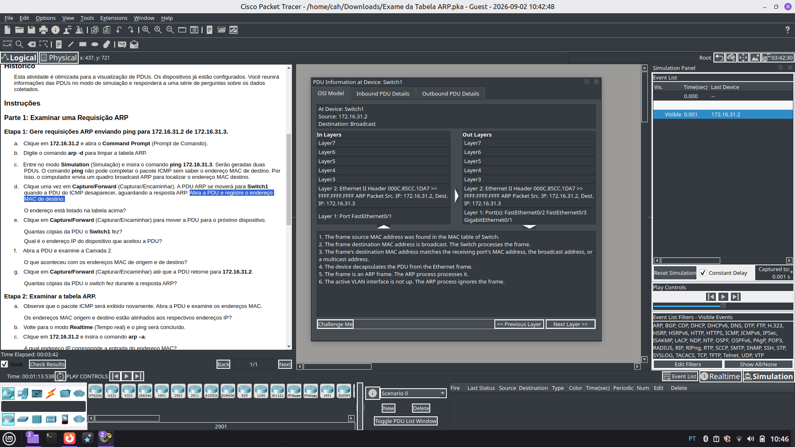
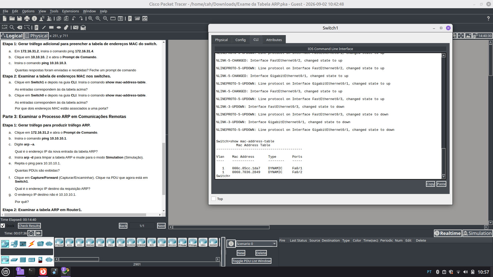

# 🛜 ARP Table Examination

## Objetivo

Analisar o funcionamento do protocolo ARP em uma rede local e durante
comunicações entre redes, observando a relação entre endereços IP e MAC,
o comportamento de switches e roteadores e o processo de descoberta de
endereços físicos.

## Contexto

Atividade desenvolvida no Cisco Packet Tracer para examinar requisições
ARP, respostas ARP, tabelas ARP e tabelas de endereços MAC.

A análise foi realizada utilizando o Simulation Mode e a visualização
das PDUs durante a comunicação entre os dispositivos.

## Conceitos estudados

- ARP
- ARP Request
- ARP Reply
- Broadcast
- Endereço MAC
- Endereço IP
- Tabela ARP
- Tabela MAC
- Switching
- Flooding
- Comunicação local
- Comunicação entre redes
- Gateway
- Processo de resolução de endereço

## Atividades realizadas

- Análise de uma requisição ARP
- Análise da resposta ARP
- Verificação da tabela ARP
- Análise da tabela MAC do switch
- Análise de comunicação remota
- Observação do comportamento do roteador durante o processo ARP

## Evidências

### ARP Request

### Tabela MAC do Switch

## Resultado

A atividade permitiu observar, na prática, como o ARP relaciona
endereços IPv4 a endereços MAC e como switches e roteadores participam
desse processo.

Também foi possível diferenciar o comportamento do ARP quando o destino
está na mesma rede local e quando a comunicação precisa passar por um
roteador.
