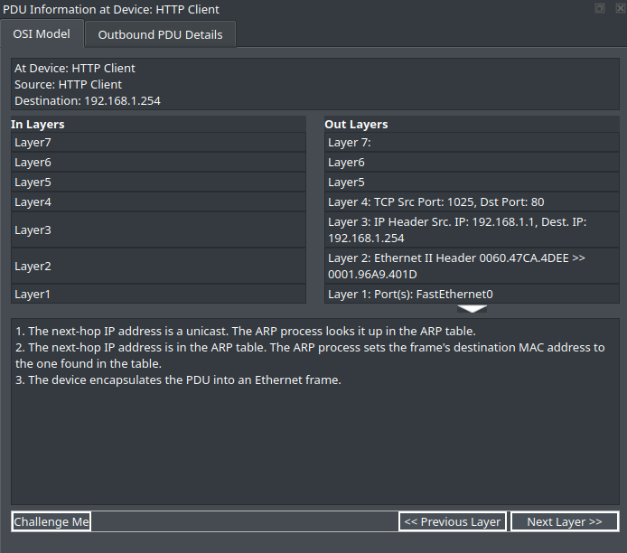
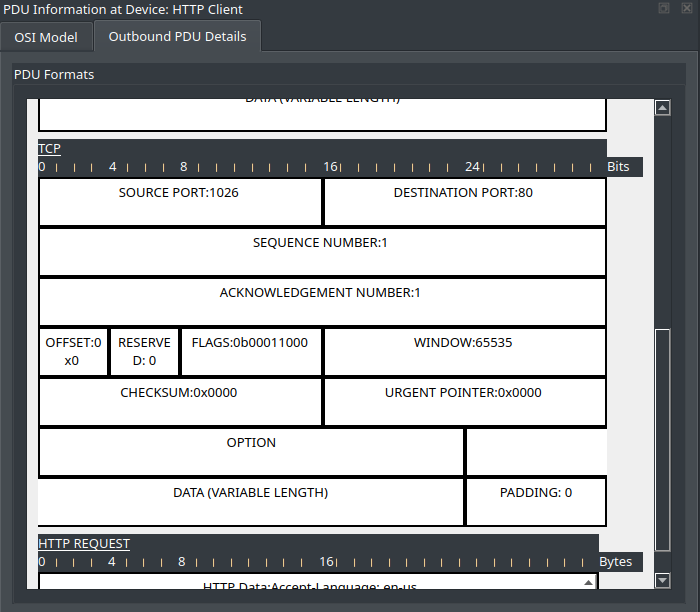
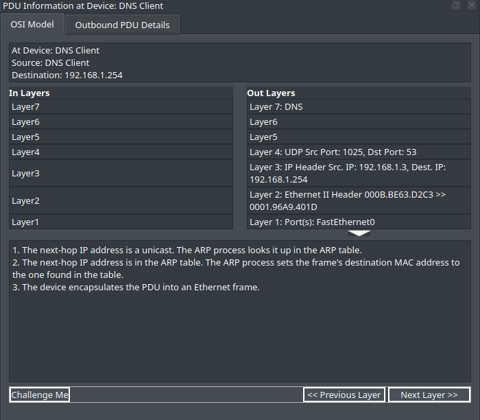
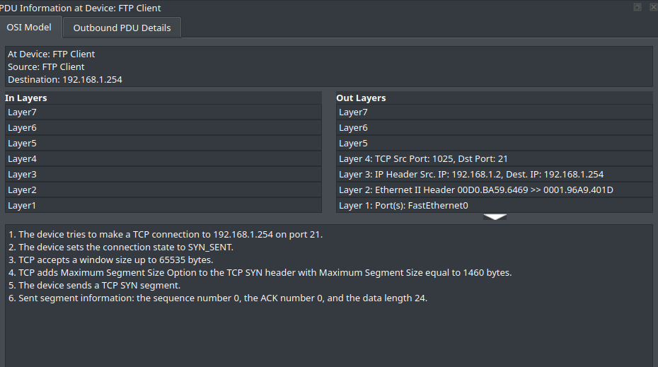

# 🛜 TCP and UDP Communications

## Objetivo

Analisar o comportamento dos protocolos TCP e UDP durante diferentes
tipos de comunicação de rede utilizando o modo Simulation do Cisco
Packet Tracer.

## Cenário

Atividade que desenvolvi para observar a comunicação entre clientes e
servidor utilizando diferentes protocolos de aplicação.

Foram analisados tráfegos HTTP, FTP, DNS e e-mail, observando os
protocolos de transporte utilizados, números de porta, números de
sequência, acknowledgements e flags TCP.

## Conceitos estudados

- TCP
- UDP
- HTTP
- FTP
- DNS
- SMTP
- POP3
- Números de porta
- Multiplexação
- Sequence Number
- Acknowledgement Number
- TCP Flags
- Comunicação orientada à conexão
- Comunicação sem conexão
- Confiabilidade na camada de transporte

## Protocolos analisados

| Protocolo | Transporte | Porta padrão | Característica |
| --------- | ---------- | -----------: | -------------- |
| HTTP      | TCP        |           80 | Confiável      |
| FTP       | TCP        |           21 | Confiável      |
| DNS       | UDP        |           53 | Sem conexão    |
| SMTP      | TCP        |           25 | Confiável      |
| POP3      | TCP        |          110 | Confiável      |

## Observações

Durante a análise, pude observar que diferentes aplicações
utilizam diferentes protocolos de transporte e números de porta para
identificar os serviços envolvidos na comunicação.

No TCP observei números de sequência, acknowledgements e flags
utilizadas no estabelecimento e gerenciamento da comunicação.

No UDP observei números de sequência e acknowledgement,
devido às características do protocolo.

## Evidências

### HTTP sobre TCP

### TCP Flags

### DNS sobre UDP

### FTP sobre TCP

## Resultado

A atividade me permitiu visualizar na prática a diferença entre TCP e UDP
e compreender como números de porta identificam os serviços e como o
TCP utiliza mecanismos de controle para proporcionar comunicação
confiável.
