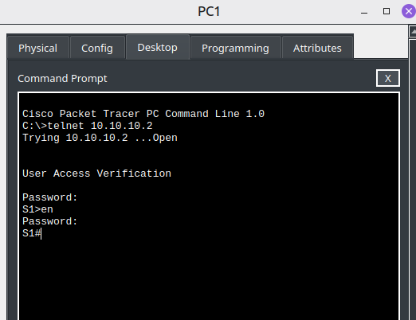
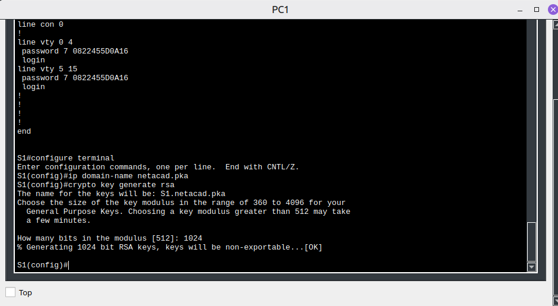
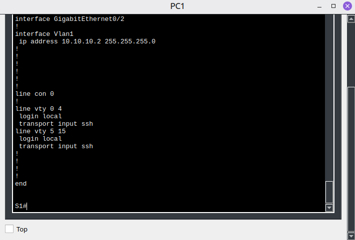
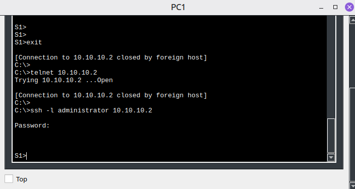

# 🛜 SSH Configuration

## Objetivo

Configurar acesso remoto seguro a um switch utilizando SSH e substituir
o acesso remoto via Telnet.

## Cenário

O laboratório apresenta inicialmente uma conexão remota utilizando
Telnet. Como o Telnet transmite informações em texto claro, realizei
a configuração do SSH como alternativa segura para gerenciamento remoto.

## Conceitos estudados

- Telnet
- SSH
- Criptografia
- RSA
- Autenticação
- VTY
- Local user database
- `login local`
- `transport input ssh`
- `service password-encryption`
- IP domain name

## Configurações realizadas

- Configuração do nome de domínio
- Geração de chaves RSA de 1024 bits
- Criação de usuário local
- Configuração das linhas VTY
- Autenticação utilizando banco de usuários local
- Restrição das linhas VTY para SSH
- Remoção do acesso Telnet

## Comparação

| Característica | Telnet | SSH |
|---|---|---|
| Criptografia | Não | Sim |
| Dados transmitidos em texto claro | Sim | Não |
| Uso recomendado para gerenciamento | Não | Sim |
| Autenticação segura | Limitada | Sim |

## Evidências

### Acesso inicial via Telnet

### Geração das chaves RSA

### Configuração SSH

### Login SSH

## Resultado

Configurei o switch para aceitar gerenciamento remoto utilizando
SSH e as linhas VTY foram configuradas para utilizar autenticação local.

O acesso remoto via Telnet deixou de ser permitido.
