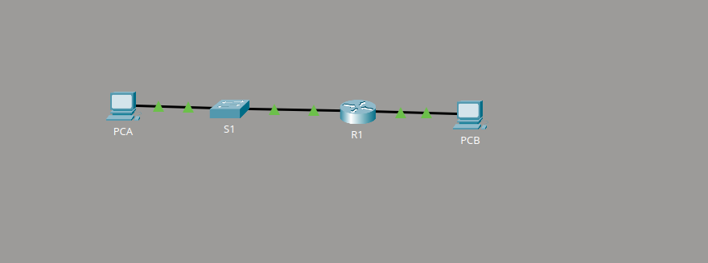
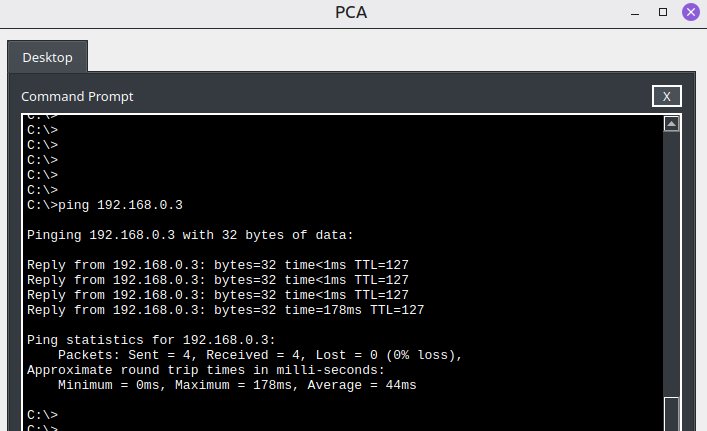
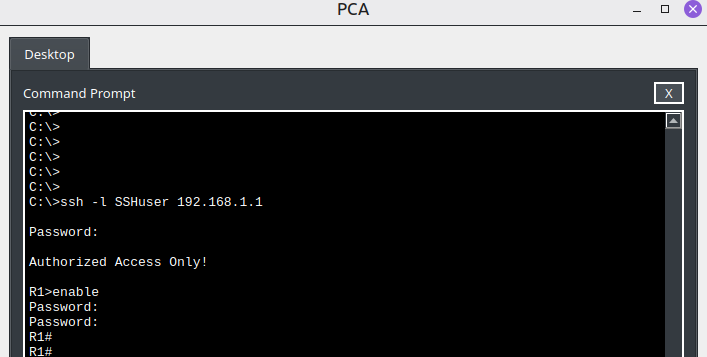

# 🛜 Construindo uma Rede com Switch e Roteador

## Descrição

Neste laboratório, eu construí e configurei uma pequena rede utilizando um roteador, um switch e dois computadores no Cisco Packet Tracer.

Configurei o endereçamento IPv4 dos dispositivos, habilitei o roteamento entre duas redes diferentes e implementei acesso remoto seguro ao roteador utilizando SSH.

## Objetivo

Configurar uma rede básica com switch e roteador, validar a conectividade entre diferentes redes e implementar gerenciamento remoto seguro.

## Contexto

A topologia representa uma pequena agência com dois computadores conectados a redes diferentes.

O PCA está conectado ao switch na rede `192.168.1.0/24`, enquanto o PCB está conectado diretamente ao roteador na rede `192.168.0.0/24`.

O roteador realiza a comunicação entre as duas redes e também permite gerenciamento remoto utilizando SSH.

## Procedimento

1. Conectei o roteador, o switch e os dois computadores.
2. Configurei endereços IPv4, máscaras de sub-rede e gateways padrão nos PCs.
3. Testei a comunicação entre PCA e PCB antes da configuração do roteador.
4. Configurei as interfaces `G0/0/0` e `G0/0/1` do roteador e as ativei com `no shutdown`.
5. Configurei hostname, senhas, banner e criptografia das senhas no roteador.
6. Configurei o switch com endereço IP de gerenciamento na VLAN 1 e gateway padrão.
7. Testei novamente a conectividade entre PCA e PCB.
8. Configurei domínio, chaves RSA, usuário local e linhas VTY para permitir somente acesso SSH ao roteador.
9. Validei o acesso remoto seguro ao roteador a partir de um dos computadores.

## Evidências

### Topologia e conectividade

*Topologia final da rede com as interfaces configuradas e os enlaces ativos.*

### Teste de conectividade

*Teste de ping entre dispositivos localizados em redes diferentes após a configuração do roteador.*

### Acesso remoto via SSH

*Sessão SSH estabelecida com sucesso para gerenciamento remoto do roteador.*

## Resultado e aprendizados

Após a configuração das interfaces do roteador, os computadores passaram a se comunicar entre as duas redes.

Com esta atividade, pratiquei:

- Endereçamento IPv4;
- Gateway padrão;
- Roteamento entre redes;
- Configuração básica de roteadores e switches Cisco;
- Configuração de interface VLAN para gerenciamento;
- Testes de conectividade com ICMP;
- Configuração de SSH;
- Geração de chaves RSA;
- Autenticação local em linhas VTY;
- Gerenciamento remoto seguro.
