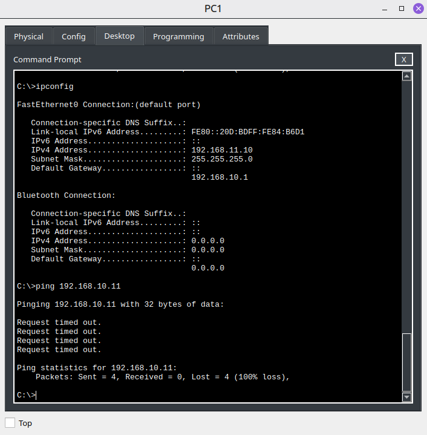
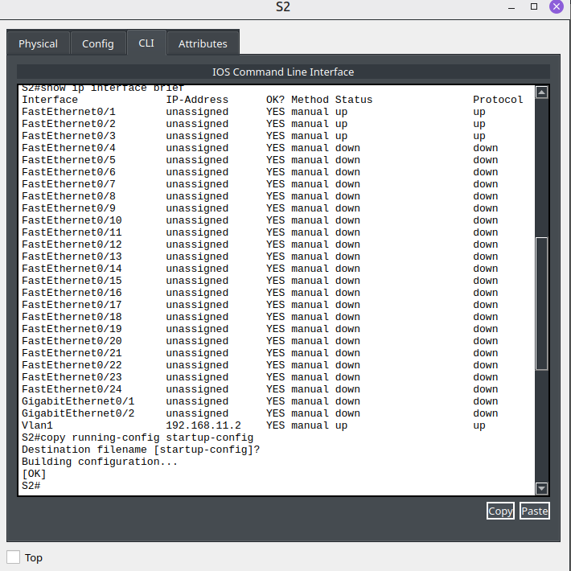
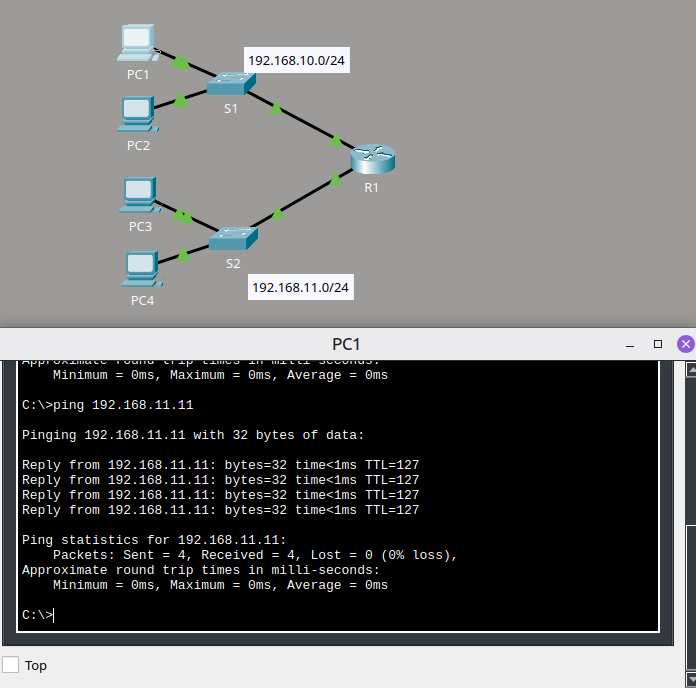

# 🛜 Troubleshooting de Gateway Padrão

## Descrição

Neste laboratório, eu analisei uma rede com problemas de conectividade no Cisco Packet Tracer utilizando uma abordagem sistemática de troubleshooting.

Realizei testes locais e entre redes, identifiquei configurações incorretas de endereçamento IPv4 e gateway padrão, corrigi cada problema individualmente e validei a conectividade após as alterações.

## Objetivo

Identificar, corrigir e validar problemas de conectividade relacionados ao endereçamento IPv4, interfaces de gerenciamento e gateway padrão.

## Contexto

A topologia possui duas redes conectadas pelo roteador R1:

- `192.168.10.0/24`
- `192.168.11.0/24`

Antes de realizar as correções, testei a comunicação entre PCs, switches e interfaces do roteador para determinar quais dispositivos apresentavam problemas.

## Procedimento

1. Completei a documentação de endereçamento e identifiquei os gateways esperados para cada rede.
2. Testei primeiro a conectividade entre dispositivos da mesma LAN.
3. Comparei as configurações encontradas com a tabela de endereçamento.
4. Corrigi cada problema individualmente.
5. Repeti os testes após cada alteração.
6. Por fim, testei a conectividade entre as duas redes.

## Problemas identificados

| Dispositivo | Problema encontrado | Correção |
|---|---|---|
| PC1 | Estava configurado com `192.168.11.10`, embora pertencesse à rede `192.168.10.0/24` | Alterei o endereço para `192.168.10.10` |
| S2 | A interface VLAN 1 não possuía endereço IPv4 configurado | Configurei `192.168.11.2/24` e ativei a interface |
| PC4 | O gateway padrão estava configurado como `192.168.1.1` | Alterei o gateway para `192.168.11.1` |

## Evidências

### Identificação do problema no PC1

*Configuração incorreta identificada durante os testes de conectividade do PC1.*

### Correção da interface de gerenciamento do S2

*Configuração da interface VLAN 1 do S2 para restaurar sua conectividade.*

### Conectividade restaurada

*Teste de conectividade ponta a ponta realizado após a correção dos problemas encontrados.*

## Resultado e aprendizados

Após as correções, validei a comunicação local e a conectividade entre as duas redes.

Com esta atividade, pratiquei:

- Troubleshooting de conectividade;
- Análise sistemática de falhas;
- Endereçamento IPv4;
- Gateway padrão;
- Configuração de interface VLAN;
- Uso de `ping` para isolamento de problemas;
- Uso de `show ip interface brief`;
- Validação de conectividade ponta a ponta.

Também observei a importância de corrigir e testar um problema por vez, evitando alterar várias configurações antes de identificar qual delas realmente causava a falha.

