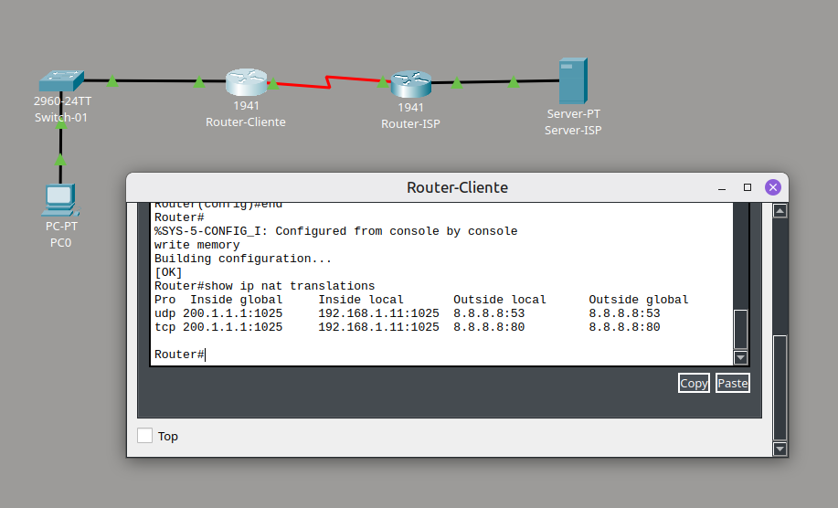
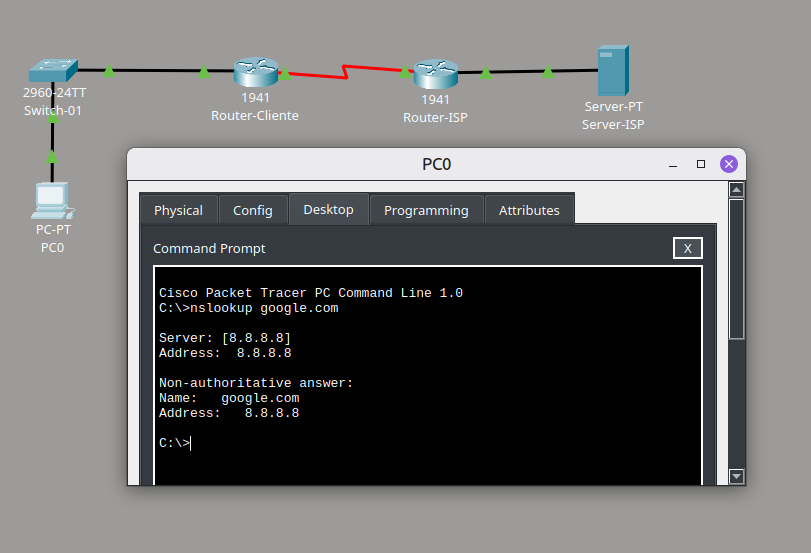

# 🛜 Configuração de LAN e ISP

## Descrição

Neste laboratório, eu configurei uma rede local conectada a uma rede simulada de provedor (ISP) utilizando o Cisco Packet Tracer.

Configurei DHCP para distribuir automaticamente os parâmetros de rede ao host da LAN, implementei NAT/PAT para permitir sua comunicação com a rede externa e configurei DNS para resolução de nomes.

## Objetivo

Construir e configurar uma rede LAN com acesso a uma rede externa, integrando endereçamento IPv4, DHCP, roteamento, NAT/PAT e DNS.

## Contexto

A topologia representa uma rede local conectada a um ISP por meio de dois roteadores.

Na LAN, o PC recebe sua configuração de rede automaticamente pelo Router-Cliente. Para alcançar o servidor externo `8.8.8.8`, o tráfego passa pelo Router-Cliente, que realiza a tradução de endereços, e segue pelo Router-ISP.

O Server-ISP também fornece o serviço DNS utilizado para resolver `google.com`.

## Procedimento

1. Montei a topologia com PC, switch, dois roteadores e servidor.
2. Configurei o Server-ISP com o endereço `8.8.8.8/24` e habilitei o serviço DNS.
3. Configurei as interfaces do Router-ISP e do Router-Cliente.
4. Configurei um pool DHCP para a rede `192.168.1.0/24`.
5. Configurei uma rota padrão no Router-Cliente apontando para o ISP.
6. Defini as interfaces internas e externas para NAT.
7. Configurei NAT overload para traduzir o tráfego da rede local.
8. Configurei o PC para obter seus parâmetros de rede via DHCP.
9. Testei a resolução DNS e a comunicação com o servidor externo.
10. Verifiquei as traduções NAT geradas pelo tráfego da LAN.

## Resultado e aprendizados

Ao final da configuração, o PC da rede local conseguiu acessar o servidor externo utilizando o nome `google.com`.

Com esta atividade, pratiquei:

- Configuração de LAN e enlace com ISP;
- Endereçamento IPv4 e sub-redes;
- Configuração de interfaces em roteadores Cisco;
- DHCP;
- Rota padrão;
- DNS;
- NAT/PAT com overload;
- ACL para identificação do tráfego sujeito à tradução;
- Verificação de traduções NAT;
- Testes de conectividade e resolução de nomes.

O comando `show ip nat translations` permitiu observar a tradução do endereço privado `192.168.1.11` para o endereço da interface externa `200.1.1.1` durante a comunicação com o servidor `8.8.8.8`.

## Evidências

### Traduções NAT/PAT

*Traduções geradas pelo Router-Cliente durante a comunicação do host da LAN com o servidor externo.*

### Resolução DNS

*Consulta DNS realizada pelo PC0, resolvendo `google.com` para o endereço `8.8.8.8`.*
