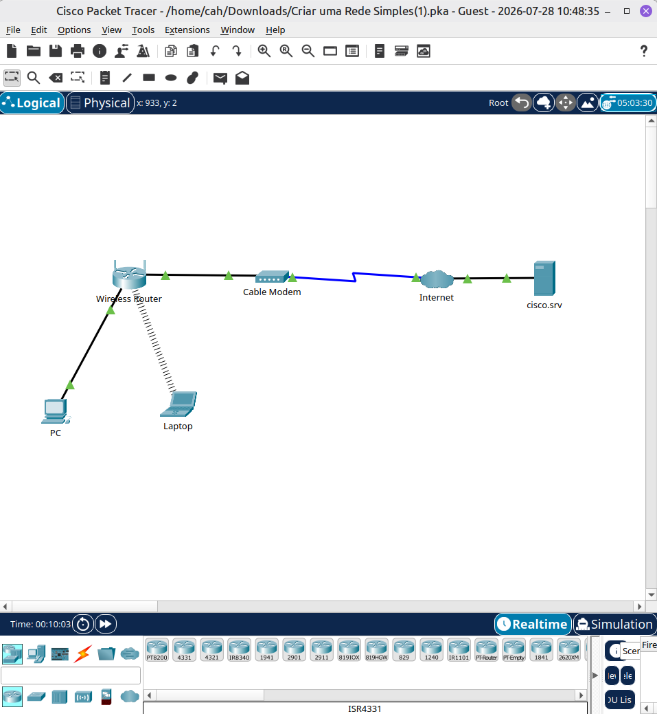
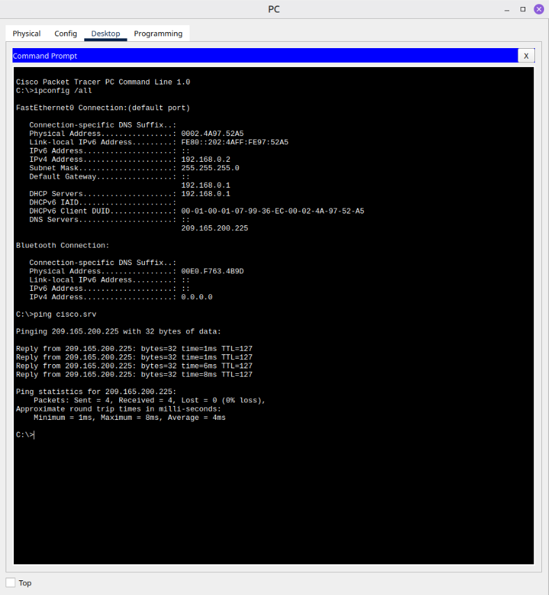

# 🛜 Packet Tracer - Laboratório 01: Rede Simples

## Objetivo

Construir uma rede local simples utilizando o Cisco Packet Tracer, conectando dispositivos de rede, configurando os dispositivos finais e verificando a conectividade.

## Cenário

Neste laboratório foi simulada uma pequena rede doméstica composta por:

* Internet (Cloud)
* Cable Modem
* Wireless Router
* PC
* Laptop

O computador foi conectado via cabo Ethernet e o notebook via rede sem fio.

## Habilidades praticadas

* Criação de topologias de rede
* Conexão física entre dispositivos
* Configuração de DHCP
* Verificação do endereçamento IPv4
* Conexão de um cliente à rede Wi-Fi
* Testes de conectividade

## Evidências

### Topologia da rede

### Teste de conectividade (Ping)

## Conceitos estudados

* DHCP
* Endereçamento IPv4
* Gateway padrão
* Conexão Ethernet
* Conexão Wireless
* Cable Modem
* Conectividade de rede

## Resultado

A atividade foi concluída com sucesso. O PC e o notebook receberam automaticamente um endereço IPv4 via DHCP e conseguiram estabelecer comunicação com a rede simulada.
